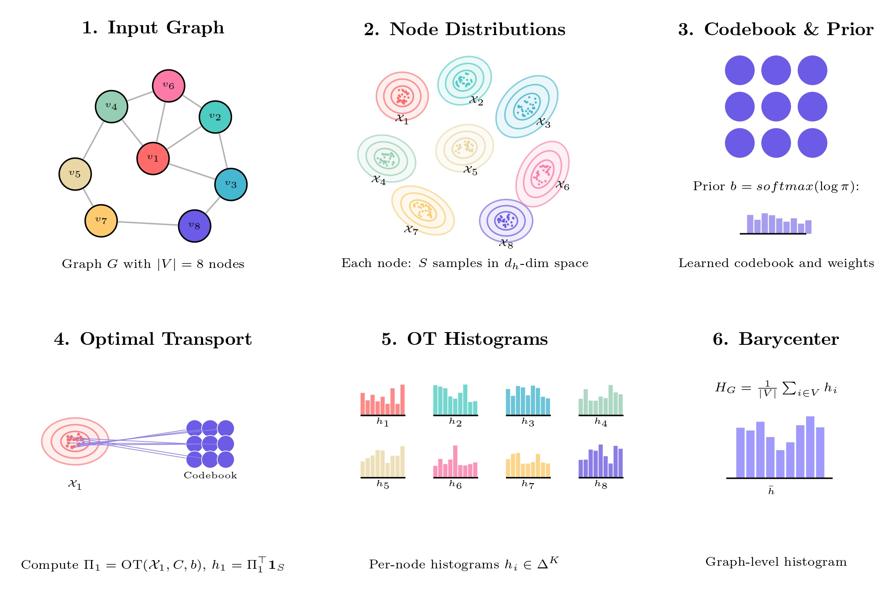

# BaryGNN: Barycentric Pooling for GNNs

BaryGNN introduces a principled, distribution-aware approach to graph-level representation learning. Each node is encoded as a set of vectors using a multi-head GNN, forming an empirical distribution in the embedding space. We then compute a Wasserstein barycenter over a learnable codebook via optimal transport (Sinkhorn through GeomLoss) and combine this barycentric summary with a traditional global pooling signal to obtain a robust graph embedding for classification. This design improves expressiveness, stability, and interpretability while remaining modular and easy to extend.

<p align="center">
  
</p>

## 📄 Preprint

**BaryGNN: Barycentric Pooling for Graph Neural Networks**  
[Fainzilber, Rabinovich, Rosiner (2025) - Preprint](https://drive.google.com/file/d/1vMnUZekgw33ItxAZfGcn1dggWy0ZpB2V/view)

<p align="center">
  <a href="https://drive.google.com/file/d/1vMnUZekgw33ItxAZfGcn1dggWy0ZpB2V/view">
    
  </a>
</p>


## Setting Up the Project

We recommend using the `pyproject.toml` as the single source of truth for dependencies and managing the environment with Conda + uv.

- Using Conda + uv (recommended):

```bash
# Create and activate a conda environment with Python 3.11+
conda create -n barygnn python=3.11 -y
conda activate barygnn

# Install uv into the conda environment
pip install uv

# Install project dependencies directly from pyproject.toml (editable install)
uv pip install -e .

# (Optional) Generate a requirements file from pyproject.toml if you need a lock snapshot
uv pip compile pyproject.toml --output-file requirements.txt
```

- Using Conda + pip (fallback):

```bash
conda create -n barygnn python=3.11 -y
conda activate barygnn
pip install -e .
```

Notes:
- Python 3.11+ is required.
- For GPU acceleration, ensure your CUDA toolkit/driver matches the pinned PyTorch version in `pyproject.toml`.
- `geomloss`, `pykeops`, and `keopscore` are included via `pyproject.toml` and will be installed automatically.

## Project Structure

```text
BaryGNN/
  barygnn/
    config/
      benchmark_configs/
      k_fold_configs/
      test_configs/
      config.py                 # Dataclass-based configuration system
    datasets/
      dataset.py                # Dataset loading & transforms (TU + OGB)
    losses/
      regularization.py         # Distribution regularization losses
    models/
      barygnn.py                # Main BaryGNN model
      encoders/                 # GIN / GraphSAGE + multi-head variants
      pooling/                  # Barycentric (OT) & regular pooling backends
      readout/                  # Combined readout of barycentric + traditional pooling
      classification/           # Classifier heads: enhanced/adaptive/deep_residual/simple
    scripts/
      evaluate.py               # Evaluation helper used by train & runners
    utils/
      logger.py, metrics.py     # Logging & metrics utilities
  data/                         # Dataset cache (auto-created)
  pyproject.toml                # Project metadata and dependencies
  train.py                      # Single-run training entry point
  run_cross_validation.py       # K-fold CV driver (TU datasets)
  run_optuna.py                 # Optuna study driver (hyperparameter search)
  run_slurm.py / run_slurm_optuna.py (optional)
  README_main.md (this file)
```

## Quick Start

Before you begin: complete the environment setup in "Setting Up the Project" (Conda + uv recommended).

Below is a complete example using our best-performing configuration: GIN encoder with the efficient multi-head variant (node distributions), barycentric pooling with weighted-mean readout, concatenated with a traditional global pooling embedding, and an enhanced MLP classifier.

1) Choose a benchmark config (example: MUTAG). A typical YAML will contain at least these key fields:

```yaml
# example: barygnn/config/benchmark_configs/MUTAG/barycentric_mutag_config.yaml
experiment_type: BaryGNN_MUTAG
seed: 42

model:
  version: v2
  hidden_dim: 64
  debug_mode: false
  encoder:
    type: GIN
    num_layers: 3
    dropout: 0.5
    multi_head_type: efficient           # efficient multi-head encoder
    shared_layers: 1
    distribution_size: 32               # number of heads (samples per node)
  pooling:
    backend: barycenter                 # OT-based barycentric pooling
    readout_type: weighted_mean         # barycentric weighted mean of codebook
    codebook_size: 16
    epsilon: 0.2                        # Sinkhorn blur (ε)
    p: 2
    scaling: 0.9
  classification:
    type: enhanced
    hidden_dims: [256, 128, 64]
    dropout: 0.2
    activation: relu
    final_dropout: 0.5
  regularization:
    enabled: true
    type: variance
    lambda_reg: 0.01

data:
  name: MUTAG
  batch_size: 32
  num_workers: 4
  split_seed: 42
  val_ratio: 0.1
  test_ratio: 0.1

training:
  num_epochs: 300
  lr: 0.001
  weight_decay: 0.0005
  patience: 20
  metric: accuracy                      # early stopping & scheduler metric
  scheduler: plateau
  scheduler_params:
    factor: 0.5
    patience: 10
    threshold: 1e-4

wandb:
  enabled: false
  project: BaryGNN
```

2) Train:

```bash
python train.py --config barygnn/config/benchmark_configs/MUTAG/barycentric_mutag_config.yaml --log_dir runs/mutag
```

- Device is auto-selected (CUDA if available).
- Best checkpoint is saved to `checkpoints/<experiment>_best.pt`.
- Final test metrics are logged after early stopping.

3) Evaluate or run cross-validation:

```bash
# 10-fold stratified CV on a TU dataset (e.g., MUTAG)
python run_cross_validation.py --config barygnn/config/k_fold_configs/MUTAG/config.yaml --n_folds 10 --stratified
```

4) Hyperparameter optimization with Optuna:

```bash
python run_optuna.py --config barygnn/config/benchmark_configs/MUTAG/optuna_config.yaml
```

## Reproducing Reported Metrics

For each benchmarked dataset, our final, best-performing configurations are provided in:

- `barygnn/config/k_fold_configs/<DATASET>/config.yaml`

These files were derived from the best Optuna trials per dataset and are the exact configurations to use for reproducing the metrics reported in the article.

Example (10-fold MUTAG):

```bash
python run_cross_validation.py --config barygnn/config/k_fold_configs/MUTAG/config.yaml --n_folds 10 --stratified
```

You can also run a single train/eval pass with the same configuration via:

```bash
python train.py --config barygnn/config/k_fold_configs/MUTAG/config.yaml --log_dir runs/mutag_kfold_cfg
```

Tips:
- IMDB datasets are featureless; we automatically apply degree-based one-hot node features.
- OGB datasets use their predefined splits; cross-validation is disabled for OGB.
- For molecular datasets, set `model.encoder.use_categorical_encoding: true` to use OGB’s `AtomEncoder`.
- Barycentric hyperparameters:
  - `model.encoder.distribution_size`: number of encoder heads (samples) per node. Larger values yield richer per-node distributions but increase memory/compute. Typical: 16–64.
  - `model.pooling.codebook_size`: number of atoms in the learnable codebook. Higher values allow finer barycentric representations but can overfit. Typical: 8–64.
  - `model.pooling.epsilon` (Sinkhorn blur): entropic regularization controlling transport smoothness. Larger ε stabilizes and smooths histograms but blurs alignment; smaller ε sharpens but may be less stable. Typical: 0.05–0.5.

## Citation

If you use BaryGNN in your research, please cite:

```bibtex
@software{barygnn_2025,
  title        = {BaryGNN: Barycentric Pooling for Graph Neural Networks},
  author       = {Fainzilber, Matan and Rabinovich, Amit and Rosiner, Ido},
  year         = {2025},
  url          = {https://github.com/matfain/BaryGNN},
  note         = {Version 0.1.0}
}

@misc{barygnn_paper_2025,
  title        = {BaryGNN: Barycentric Pooling for Graph Neural Networks},
  author       = {Fainzilber, Matan and Rabinovich, Amit and Rosiner, Ido},
  year         = {2025},
  url          = {https://drive.google.com/file/d/1vMnUZekgw33ItxAZfGcn1dggWy0ZpB2V/view},
  note         = {Preprint}
}
``` 
