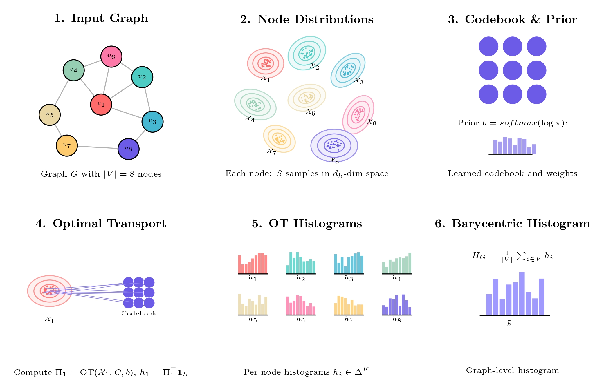

# BaryGNN

BaryGNN is a novel Graph Neural Network (GNN) pooling method that represents each node as an empirical distribution and computes graph-level embeddings using 2-Wasserstein barycenters with a learnable codebook. This approach preserves uncertainty, captures multi-modal structure, and respects the non-Euclidean geometry of latent spaces.

## Key Features

### 🚀 **BaryGNN Key Features**
- **Multi-Head Node Encoders**: True node distribution representation using multiple GNN heads instead of naive linear projection
- **GeomLoss Integration**: Robust optimal transport algorithms using the GeomLoss library
- **Enhanced Classifiers**: Advanced MLP architectures with residual connections, multiple activation functions, and adaptive sizing
- **Distribution Regularization**: Learnable regularization to ensure meaningful node distributions
- **Comprehensive Configuration**: Flexible configuration system supporting all new features

### 🧠 **Core Architecture**
- **Node Distributions**: Each node is represented as 32 learnable vectors forming an empirical distribution
- **Barycentric Pooling**: Graph-level embeddings computed as 2-Wasserstein barycenters using optimal transport
- **Learnable Codebook**: Shared codebook atoms across all graphs for consistent representations
- **End-to-End Training**: Fully differentiable pipeline from node features to graph classification

## Environment Setup (conda + uv)

To set up the development environment on a new machine:

1. **Clone the repository:**
   ```bash
   git clone https://github.com/matfain/BaryGNN.git
   cd BaryGNN
   ```

2. **Install [Anaconda](https://www.anaconda.com/products/distribution) or [Miniconda](https://docs.conda.io/en/latest/miniconda.html)** if not already installed.

3. **Create and activate the conda environment:**
   ```bash
   conda create -y -n barygnn python=3.11
   conda activate barygnn
   ```

4. **Install [uv](https://astral.sh/docs/uv/):**
   ```bash
   pip install uv
   ```

5. **Install all project dependencies:**
   ```bash
   uv pip install -r requirements.txt
   ```
   - If you want to regenerate the requirements file from the project definition:
     ```bash
     uv pip compile pyproject.toml --output-file requirements.txt
     uv pip install -r requirements.txt
     ```

6. **You're ready to go!**

**Dependencies include:**
- PyTorch & PyTorch Geometric for GNN implementation
- GeomLoss for optimal transport computations
- Weights & Biases for experiment tracking
- Standard scientific computing libraries (NumPy, SciPy, scikit-learn)

## Project Structure

```
BaryGNN/
├── README.md                 # Project overview, installation, usage
├── pyproject.toml            # Project dependencies and metadata
├── requirements.txt          # Pinned dependencies
├── .gitignore                # Git ignore patterns
│
├── barygnn/                  # Main package directory
│   ├── __init__.py           # Package initialization
│   │
│   ├── models/               # Neural network models
│   │   ├── __init__.py
│   │   ├── barygnn.py        # Enhanced BaryGNN model ⭐
│   │   │
│   │   ├── encoders/         # Graph node encoders
│   │   │   ├── __init__.py
│   │   │   ├── base.py       # Base encoder interface
│   │   │   ├── gin.py        # GIN encoder implementation
│   │   │   ├── sage.py       # GraphSAGE encoder implementation
│   │   │   └── multi_head.py # Multi-head encoder architectures ⭐
│   │   │
│   │   ├── pooling/          # Pooling methods
│   │   │   ├── __init__.py
│   │   │   ├── geomloss_pooling.py    # GeomLoss-based pooling ⭐
│   │   │   └── hier_sinkhorn.py       # Hierarchical pooling ⭐
│   │   │
│   │   ├── readout/          # Readout methods
│   │   │   ├── __init__.py
│   │   │   └── readout.py    # Readout implementation
│   │   │
│   │   └── classification/   # Classification heads
│   │       ├── __init__.py
│   │       ├── mlp.py        # Simple MLP classification head
│   │       └── enhanced_mlp.py # Advanced MLP architectures ⭐
│   │
│   ├── losses/               # Regularization losses ⭐
│   │   ├── __init__.py
│   │   └── regularization.py # Distribution regularization losses
│   │
│   ├── config/               # Configuration management ⭐
│   │   ├── __init__.py
│   │   ├── config.py         # Enhanced configuration dataclasses
│   │   └── default_config.yaml    # Default configuration
│   │
│   ├── data/                 # Data loading and preprocessing
│   │   ├── __init__.py
│   │   └── dataset.py        # Dataset utilities
│   │
│   ├── utils/                # Utility functions
│   │   ├── __init__.py
│   │   ├── metrics.py        # Evaluation metrics
│   │   └── logger.py         # Logging utilities
│   │
│   └── scripts/              # Training and evaluation scripts
│       ├── __init__.py
│       ├── train.py          # Main training script
│       └── evaluate.py       # Model evaluation script
│
└── examples/                 # Example usage scripts
    ├── barygnn_config_training.py     # Configuration-based training ⭐
    ├── barygnn_config.yaml            # Example configuration file ⭐
    └── run_barygnn_config.sh          # SLURM batch script
```

## Quick Start

### Using the Configuration System (Recommended)

The easiest way to train BaryGNN is using the configuration system:

1. **Create or modify a configuration file** (see `examples/barygnn_config.yaml`):

```yaml
experiment_type: "my_barygnn_experiment"
seed: 42

model:
  version: "v2"
  hidden_dim: 64
  readout_type: "weighted_mean"
  
  encoder:
    type: "GIN"
    multi_head_type: "efficient"    # "full" or "efficient"
    distribution_size: 32           # Vectors per node
    
  pooling:
    codebook_size: 32              # Number of codebook atoms
    epsilon: 0.2                   # Sinkhorn regularization
    max_iter: 100                  # POT max iterations
    tol: 1e-6                      # POT convergence tolerance
    
  classification:
    type: "enhanced"               # Advanced MLP
    hidden_dims: [256, 128, 64]
    
data:
  name: "MUTAG"
  batch_size: 32
  
training:
  num_epochs: 200
  lr: 0.001
  
wandb:
  enabled: true
  project: "BaryGNN"
```

2. **Run training:**
```bash
python examples/barygnn_config_training.py --config examples/barygnn_config.yaml
```

### Configuration Details

**Multi-Head Encoders:**
- `efficient`: Shared GNN backbone with projection heads (recommended)
- `full`: Separate GNN for each head (more parameters)

**GeomLoss Pooling:**
- `epsilon`: Regularization parameter for Sinkhorn algorithm
- `max_iter`: Maximum iterations for convergence
- `tol`: Convergence tolerance

**Enhanced Classifiers:**
- `simple`: Basic MLP
- `enhanced`: MLP with residual connections and normalization
- `adaptive`: Dynamically sized MLP
- `deep_residual`: Deep residual MLP blocks

**Readout Types:**
- `weighted_mean`: Weighted mean of codebook atoms (recommended)
- `concat`: Concatenates histogram weights with flattened codebook atoms
- `combined`: Combines barycentric pooling with traditional graph pooling methods

### Combined Readout

The new `combined` readout type allows you to combine the power of barycentric pooling with traditional graph pooling methods:

```yaml
model:
  readout_type: "combined"
  combined_readout: "global_add_pool"  # Options: global_add_pool, global_mean_pool, global_max_pool
  barycentric_readout: "weighted_mean"  # Options: weighted_mean, concat
```

This creates graph embeddings by concatenating:
1. **Barycentric embedding**: Computed using optimal transport
2. **Traditional embedding**: Computed using standard graph pooling on the node distributions

The resulting embedding has dimension `hidden_dim * 2` (barycentric + traditional).

### Readout and Classification

```python
# Create final graph embedding
if readout_type == "weighted_mean":
    graph_embedding = torch.sum(barycenter_weights.unsqueeze(-1) * codebook, dim=1)
elif readout_type == "concat":
    # Concatenate histogram weights with flattened codebook atoms
    flattened_codebook = codebook.flatten()
    graph_embedding = torch.cat([barycenter_weights, flattened_codebook.expand(batch_size, -1)], dim=1)
else:  # "combined"
    # Combine barycentric and traditional pooling
    graph_embedding = torch.cat([barycentric_emb, traditional_emb], dim=1)

# Classification
logits = classifier(graph_embedding)
```

## Weights & Biases Integration

BaryGNN includes comprehensive W&B logging:

```yaml
wandb:
  enabled: true
  project: "BaryGNN"
  tags: ["multi-head", "geomloss", "enhanced"]
  log_gradients: true
  log_parameters: true
  watch_model: true
```

## Performance Tips

1. **Use GeomLoss**: More stable and robust than custom implementations
2. **Start with "efficient" multi-head**: Better dimension consistency
3. **Use enhanced classifiers**: Better performance with residual connections
4. **Enable distribution regularization**: Helps learn meaningful distributions
5. **Monitor W&B logs**: Track training progress and hyperparameter effects

## Troubleshooting

### Dimension Compatibility Issues

When using BaryGNN, ensure dimension compatibility between components:

- **Issue**: Dimension mismatches between encoder output and pooling layer.

- **Solution**: Ensure `hidden_dim` is consistent throughout your configuration:

```yaml
# Recommended configuration
model:
  hidden_dim: 64  # This dimension must be consistent!
  
  encoder:
    hidden_dim: 64  # Must match model.hidden_dim
    multi_head_type: "efficient"  # Preferred for dimension consistency
```

### GeomLoss Convergence Issues

If you see warnings about convergence:
- This is normal behavior when GeomLoss's Sinkhorn algorithm produces very small weights
- The system automatically falls back to uniform weights
- Consider adjusting `epsilon` (typically 0.1-0.5) or `max_iter` if issues persist

## Citation

If you use BaryGNN in your research, please cite:

```bibtex
@article{barygnn2024,
  title={BaryGNN: Barycentric Pooling for Graph Neural Networks},
  author={Your Name},
  journal={arXiv preprint},
  year={2024}
}
```